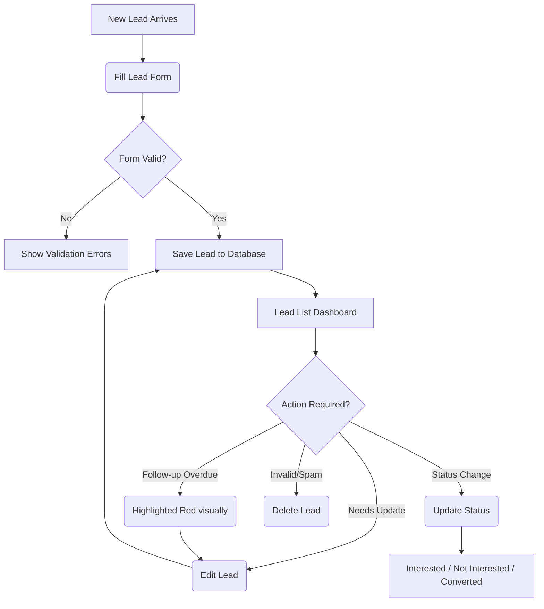

# Lead Management Dashboard 🚀

A professional, high-performance **Lead Management CRM** built with **React** and **Vite**. This application is designed to help businesses efficiently capture, track, and manage their sales pipeline with an intuitive, glassmorphism-inspired dark mode interface.


## ✨ Core CRM Features

- **Full CRUD Operations**:
  - Add new leads instantly.
  - Edit existing lead information dynamically.
  - Delete outdated or invalid leads effortlessly.
- **Lead Status Management**: 
  - Track the sales funnel using color-coded statuses: **Interested**, **Not Interested**, and **Converted**.
- **Intelligent Follow-up Tracking**: 
  - **Today's Follow-ups**: Dedicated section highlighting leads scheduled for the current day.
  - **Overdue Highlights**: Visually alerts you with a subtle red highlight if a lead's follow-up date has passed.
- **Robust Form Validation (Real-time)**:
  - Smart validation ensuring clean data (e.g., 10-digit mobile numbers, proper email formats).
  - Submit buttons remain disabled until the form is completely valid.

## 🎨 Premium UI/UX Aesthetics

- **Custom Glassmorphism Design**: Semi-transparent, blur-backed cards layered over a deep navy blue abstract background.
- **Micro-Animations**: Smooth, bouncy hover effects (`cubic-bezier`) that make cards and buttons physically lift off the page.
- **Theme Support**: Integrated dark/light mode toggle adapting to user preferences.

## 🔄 CRM Workflow Architecture

The following flowchart outlines the lifecycle of a lead within this application:



## 🚀 Tech Stack

- **Frontend**: React.js 19
- **Build Tool**: Vite
- **Styling**: Vanilla CSS3 (Custom Glassmorphism System)
- **Icons**: Lucide React
- **State Management**: React Hooks (`useState`, `useEffect`)
- **Persistence**: LocalStorage (Currently architected for easy backend migration)

## 🏁 Getting Started

### Prerequisites
- Node.js (v18.x or higher recommended)
- npm or yarn

### Installation
1. Clone the repository:
   ```bash
   git clone https://github.com/its-Sittu/Sankh-Labs---Internship.git
   ```
2. Navigate to the project directory:
   ```bash
   cd "Skill Labs"
   ```
3. Install dependencies:
   ```bash
   npm install
   ```
4. Start the development server:
   ```bash
   npm run dev
   ```

---
*Built with ❤️ focusing on seamless user experience and modern web standards.*
